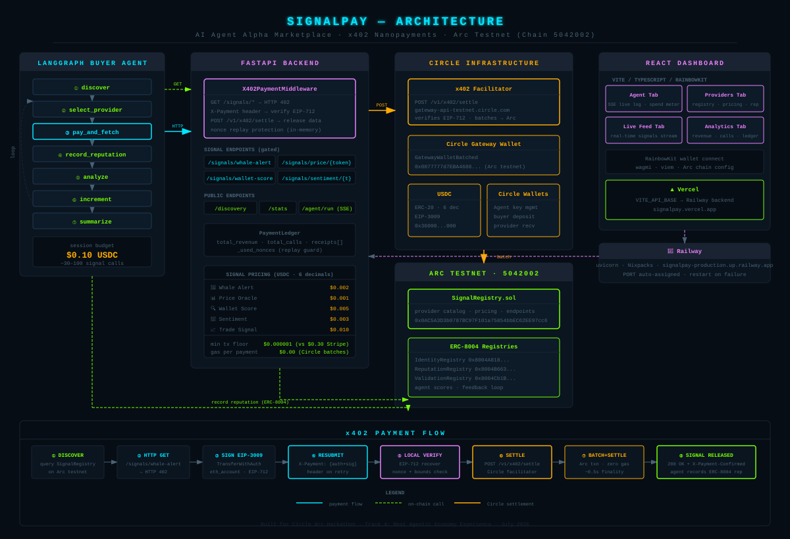

# SignalPay — AI Agent Alpha Marketplace

> AI agents buy and sell crypto alpha signals via nanopayments on Arc. Sub-cent payments, zero gas, real-time settlement.

Built for the **Circle Arc Hackathon** — Track 4: Best Agentic Economy Experience (July 2026).

## What It Does

SignalPay is a marketplace where autonomous AI agents pay for data feeds — whale alerts, price oracles, wallet scores, sentiment analysis — using Circle Nanopayments on Arc. Every API call costs a fraction of a cent in USDC, with zero gas per transaction.

**The core loop:**
1. Buyer agent discovers signal providers on-chain (SignalRegistry on Arc)
2. Evaluates providers by ERC-8004 reputation scores
3. Sends HTTP request to provider's x402 endpoint
4. Receives HTTP 402 → signs EIP-3009 payment authorization
5. Pays via Circle Nanopayments ($0.001–$0.01 per call, zero gas)
6. Receives signal data instantly
7. Records provider reputation on-chain (ERC-8004)
8. Repeats — spending $0.10 total across dozens of signal purchases

## Architecture



```
LangGraph Buyer Agent
    │
    ├── Discover providers (SignalRegistry on Arc)
    ├── Check reputation (ERC-8004 ReputationRegistry)
    ├── Pay via x402 nanopayment (EIP-3009 → Circle API)
    ├── Receive signal data
    ├── Analyze & decide
    └── Record reputation feedback (ERC-8004)
         │
         ▼
SignalPay API Server (FastAPI)
    │
    ├── x402 Payment Middleware
    │   └── HTTP 402 → payment required → validate → release data
    │
    ├── Signal Providers
    │   ├── Whale Alert (Solana alpha engine)
    │   ├── Price Oracle (aggregated feeds)
    │   ├── Wallet Scorer (alpha/risk profiling)
    │   └── Sentiment Engine (social signals)
    │
    └── Circle Nanopayments API
        └── Off-chain aggregation → batched Arc settlement
```

## Circle Products Used

| Product | How We Use It |
|---|---|
| **Nanopayments** | Zero-gas sub-cent payments for every API call |
| **x402 Protocol** | HTTP-native payment flow (402 → sign → pay → access) |
| **Gateway Wallets** | Agent deposits USDC once, pays thousands of times |
| **Dev-Controlled Wallets** | Manage agent wallet keys via API |
| **ERC-8004** | On-chain agent identity + reputation scoring |
| **Arc Settlement** | Batched nanopayment settlement on Arc L1 |

## Smart Contracts

| Contract | Address | Status |
|---|---|---|
| **SignalRegistry** | `TBD` (deploy with Foundry) | Custom — provider catalog + pricing |
| ERC-8004 IdentityRegistry | `0x8004A818BFB912233c491871b3d84c89A494BD9e` | Already deployed |
| ERC-8004 ReputationRegistry | `0x8004B663056A597Dffe9eCcC1965A193B7388713` | Already deployed |
| ERC-8004 ValidationRegistry | `0x8004Cb1BF31DAf7788923b405b754f57acEB4272` | Already deployed |

## Quick Start

### 1. Deploy SignalRegistry

```bash
cd contracts
forge install foundry-rs/forge-std
forge test -vv

# Deploy to Arc Testnet
cp ../.env.example ../.env && source ../.env
forge script script/Deploy.s.sol:DeploySignalRegistry \
  --rpc-url $ARC_TESTNET_RPC_URL \
  --private-key $PRIVATE_KEY \
  --broadcast
```

### 2. Run the Signal Provider API

```bash
cd backend
pip install -r requirements.txt
uvicorn app.server:app --host 0.0.0.0 --port 8000 --reload
```

Test discovery (no payment required):
```bash
curl http://localhost:8000/discovery/providers
```

Test a gated endpoint (returns 402):
```bash
curl -v http://localhost:8000/signals/whale-alert
# → HTTP 402 with x402 payment requirements
```

### 3. Run the Buyer Agent

```bash
cd backend
python -m agents.buyer_agent
```

### 4. Run the Frontend

```bash
cd frontend
npm install
npm run dev
# → http://localhost:5173
```

## Project Structure

```
signalpay/
├── contracts/
│   ├── src/SignalRegistry.sol        # Provider catalog + pricing
│   ├── test/SignalRegistry.t.sol     # 12 Forge tests
│   ├── script/Deploy.s.sol           # Arc Testnet deploy
│   └── foundry.toml
├── backend/
│   ├── app/
│   │   ├── config.py                 # Arc constants, contract addresses
│   │   ├── server.py                 # FastAPI with x402-gated endpoints
│   │   └── x402.py                   # x402 payment middleware
│   ├── providers/
│   │   └── signals.py                # Signal adapters (whale, price, score, sentiment)
│   ├── agents/
│   │   └── buyer_agent.py            # LangGraph buyer agent
│   └── requirements.txt
├── frontend/
│   ├── src/
│   │   ├── App.tsx                   # React dashboard (4 tabs)
│   │   └── main.tsx
│   ├── index.html
│   ├── package.json
│   ├── vite.config.ts
│   └── tsconfig.json
├── .env.example
└── README.md
```

## Signal Pricing

| Signal | Price per Call | Category |
|---|---|---|
| Whale Alert | $0.002 | Real-time large wallet movements |
| Price Oracle | $0.001 | Token price feeds with OHLCV |
| Wallet Score | $0.005 | Alpha/risk profiling for any wallet |
| Sentiment | $0.003 | Social/news sentiment scoring |

## Why This Matters

Traditional API monetization uses monthly subscriptions or per-request billing with credit cards — minimum viable transaction is ~$0.30 (Stripe's floor). With Nanopayments on Arc, the floor drops to $0.000001. This unlocks:

- **Per-call pricing** for AI agents consuming thousands of API calls/minute
- **Zero gas overhead** — Circle batches settlement, agents pay nothing per tx
- **Reputation-driven markets** — agents score providers on-chain, bad data = low scores = fewer customers
- **Autonomous commerce** — no accounts, no credit cards, just signed USDC authorizations

## Buyer Wallet Setup

The buyer agent uses a separate wallet from the signal provider. To run the full end-to-end payment flow:

1. Fund the buyer wallet with testnet USDC at [faucet.circle.com](https://faucet.circle.com)
2. Set `BUYER_PRIVATE_KEY` and `BUYER_WALLET` in `.env`
3. The agent signs EIP-3009 authorizations from the buyer wallet to the provider wallet

---

<!-- Circle Product Feedback START -->
## Circle Product Feedback

### Why We Chose These Products

SignalPay has a fundamental economic constraint: no existing payment infrastructure works at the price points AI agents actually need. Stripe's floor is $0.30 — that's 150x the price of a whale alert signal. We chose Circle's stack because it solves the three problems that make agent-to-agent commerce otherwise impossible:

**Nanopayments + x402** maps perfectly onto how agents interact with APIs. Payment becomes a one-header operation: receive 402, sign EIP-3009, retry with `X-Payment`. No accounts, no subscriptions — the agent does it autonomously. We ran 30+ signal purchases in a single $0.10 budget session.

**USDC** gives agents a stable unit of account for budget reasoning. Volatile gas tokens break the math. USDC at 6-decimal precision lets the agent reason deterministically: "I have $0.10, each signal costs $0.002, I can buy 50 signals."

**Circle Gateway (GatewayWalletBatched)** makes nanopayments economically viable. Without batching, a $0.002 payment with $0.001 gas overhead is a 50% fee. Gateway's off-chain aggregation + batched Arc settlement means infrastructure cost is effectively zero per call.

**Arc Testnet** (chain 5042002) provided ~0.5s finality, dollar-denominated fees, and pre-deployed ERC-8004 registries (Identity, Reputation, Validation) — the agent identity layer we needed without building it ourselves.

### What Worked Well

- **x402 protocol clarity**: HTTP-native design (402 → sign → retry) maps cleanly onto API patterns. Seller middleware in ~300 lines of Python; buyer-side signing in ~60 lines.
- **EIP-3009 replay protection built in**: The `nonce` field means each authorization settles once — a security property we get from the signature scheme, not something we had to bolt on.
- **Structured error reasons from the facilitator**: `insufficient_balance`, `invalid_signature`, `self_transfer` are concrete — we knew exactly what was wrong at each debugging step.
- **LangGraph + SSE for demo clarity**: Streaming the agent's decision loop to the React dashboard makes autonomous commerce tangible — judges watch the agent discover, pay, and receive in real time.
- **Arc testnet stability**: Stable throughout development, faucet worked reliably, no chain issues.

### What Could Be Improved

- **x402 settle body is non-obvious**: `paymentPayload.accepted` mirrors `paymentRequirements` (redundant), `resource` is required but easy to miss, and authorization numeric fields must be strings despite being integers in EIP-3009. Each took a debug cycle to discover.
- **No Python x402 client library**: The `@circle-fin/x402-batching` package handles signing and retry in Node/TypeScript. The agentic economy is primarily Python (LangChain, LangGraph, CrewAI, AutoGen). We implemented EIP-712 signing from scratch. A `circle-x402-python` package would dramatically accelerate adoption.
- **Fragmented developer onboarding**: Protocol spec, facilitator docs, EIP-3009 standard, and Arc config live in different places. A single end-to-end Python + TypeScript quickstart covering seller middleware + buyer client + facilitator would cut setup time by hours.
- **Gateway wallet registration is opaque**: `wallet_not_found` from the facilitator implies a registration step, but testnet documentation for it was unclear.

### Recommendations

1. **Publish a Python x402 client library** — `pip install circle-x402` with a drop-in `httpx`/`requests` wrapper handling 402 → sign → retry. This unlocks the entire Python AI agent ecosystem.
2. **Add a `/v1/x402/verify` testnet endpoint** — validate a signed payload without spending funds. Spec exists, testnet endpoint wasn't reachable during development.
3. **Structured field-level validation errors** — return `{ "validationErrors": [{ "field": "...", "code": "required" }] }` instead of message strings so tooling can parse them.
4. **Streaming payment primitive** — x402 is request/response (one payment per call). Agentic use cases need per-token, per-second, and per-inference-step streaming. A payment channel or continuous authorization on top of the batch infrastructure would unlock a new category of applications.
5. **ERC-8004 documentation** — identity and reputation registries are exactly what multi-agent systems need but documentation is sparse. A guide showing register → write → query from another contract would make this much more accessible.
<!-- Circle Product Feedback END -->

---

## License

MIT
